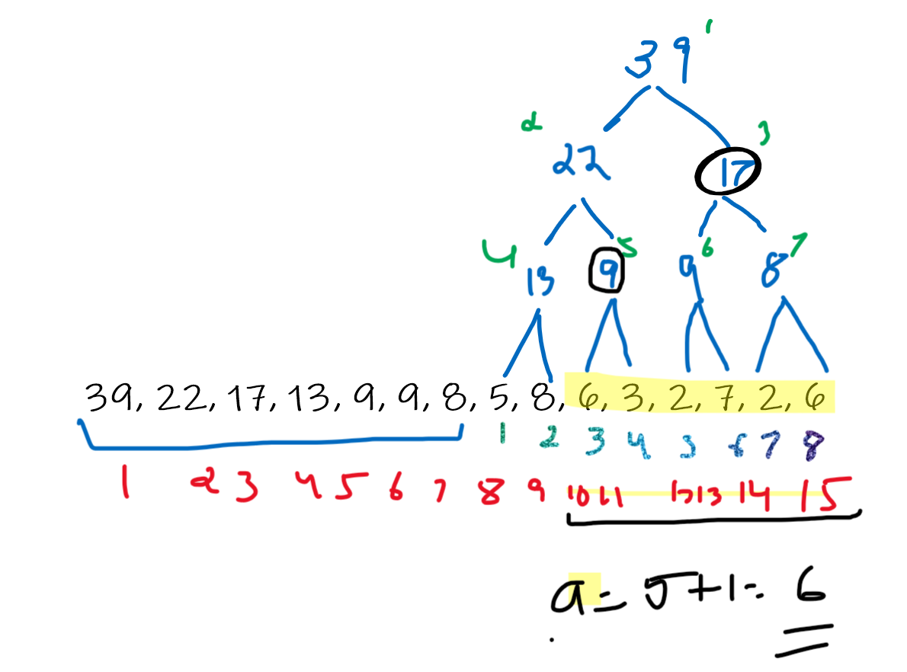

# Segment Trees

## sum()

```c++
ll sum(ll a, ll b) {
  a += n; b += n;
  ll res = 0;
  while (a <= b) {
    if (a % 2 == 1) res += tree[a++];
    if (b % 2 == 0) res += tree[b--];
    a /= 2; b /= 2;
  }
  return res;
  }
};
```

At each step,
the range is moved one level higher in the tree (n/2), and before that, the values of the
nodes that do not belong to the higher range are added to the sum

**Remember**
While considering the left part of the range we move up (n/2) and right (n++). So if we encounter an index which is odd (that means right child) we add it to the result as we would be moving to the parent of the adjacent right tree.

Similarly, while considering the right part we move up (n/2) and left (n--). Hence if we encounter a left child (even index) we add it to the result as we would be moving to the parent of the left sub tree.



## Tree manoeuvre

We store a segment tree as an array of 2n elements where n is the size of the
original array and a power of two. The tree nodes are stored from top to bottom:
tree[1] is the top node, tree[2] and tree[3] are its children, and so on. Finally, the values from tree[n] to tree[2n−1] correspond to the values of the original
array on the bottom level of the tree.

- Using this representation, the parent of tree[k] is tree[⌊k/2⌋], and its children
  are tree[2k] and tree[2k +1].
- Note that this implies that the position of a node
  is even if it is a left child and odd if it is a right child.
